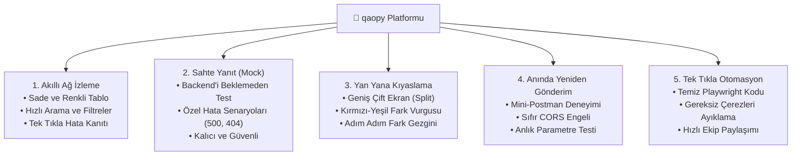

# 🚀 qaopy – Yeni Nesil Web & API Test Asistanı
### *QA ve Geliştirme Ekipleri İçin Hepsi-Bir-Arada DevTools Eklentisi*

---

## 🎯 1. Neden qaopy? (Çözdüğümüz Problem)

Web uygulamalarını ve mobil web arayüzlerini test ederken ekiplerin karşılaştığı en büyük zorluklar:
1. **Karmaşık Ağ Ekranları:** Tarayıcının standart Network sekmesi binlerce gereksiz satırla doludur; aranan isteği ve hatayı bulmak çok zordur.
2. **Backend Bağımlılığı:** Bir hata senaryosunu (örn: 500 Sunucu Hatası veya Yetersiz Bakiye uyarısı) test etmek için backend ekibinin servisi hazırlamasını beklemek gerekir.
3. **Zor Fark Tespiti:** Beklenen veri ile gelen veri arasındaki küçük farkları (örn. 500 satırlık bir JSON cevabında tek bir yanlış alanı) gözle bulmak imkansıza yakındır.
4. **Programlar Arası Geçiş Kaybı:** Bir isteği değiştirmek veya test etmek için Postman açmak, header'ları tek tek kopyalayıp yapıştırmak ciddi zaman kaybettirir.

> **💡 qaopy Çözümü:** Tüm bu test süreçlerini **tek bir tarayıcı sekmesinde**, ekstra hiçbir programa ihtiyaç duymadan, saniyeler içinde çözmenizi sağlar.

---

## 🌟 2. qaopy'nin 5 Büyük Gücü

---

### 1️⃣ Akıllı Ağ Takibi & Kolay Filtreleme
* **Temiz Görünüm:** İstekleri önem sırasına göre `[Seçim] → [URL] → [Durum Kodu] → [Metot]` olarak düzenler.
* **Trafik Işıkları (Renk Kodları):** 
  * 🟢 **Yeşil (200):** Başarılı
  * 🟡 **Sarı (300):** Yönlendirme
  * 🔴 **Kırmızı (400/500):** Hatalı istekler anında göze çarpar.
* **Canlı Arama:** Aradığınız servisi, parametreyi veya kelimeyi yazdığınız anda filtreler.

---

### 2️⃣ Sahte Yanıt (Mock Response) ile Özgür Test
* **Backend'i Beklemeye Son:** Servis henüz hazır olmasa bile sahte bir yanıt tanımlayarak frontend ekranının nasıl tepki verdiğini test edebilirsiniz.
* **Kritik Senaryo Testleri:** Normalde üretmesi zor olan "Sunucu Çöktü (500)", "Kart Limiti Yetersiz" veya "Hatalı Giriş" gibi uç durumları 3 tıkla simüle edin.
* **Belirgin Rozet:** Hangi servisin sahte yanıt döndüğü tabloda **`🔴 MOCK`** rozetiyle açıkça gösterilir.

---

### 3️⃣ Yan Yana (Side-by-Side) Görsel Kıyaslama
* **Farkları Gözden Kaçırmayın:** Gelen yanıt ile beklediğiniz yanıtı yan yana geniş ekranda açar.
* **Kırmızı & Yeşil Vurgu:**
  * 🔴 **Kırmızı:** Silinen veya değişen alanlar.
  * 🟢 **Yeşil:** Yeni eklenen veya farklı gelen alanlar.
* **Adım Adım Gezgin (`▲` / `▼`):** Yüzlerce satır kodun içinde kaybolmayın; üstteki butonlarla sadece farklı olan satırlara otomatik olarak odaklanıp gezinin.

---

### 4️⃣ Anında Yeniden İstek Gönderme (Mini-Postman)
* **Program Değiştirmeden Test:** Beğendiğiniz bir isteği seçip parametrelerini veya gövdesini değiştirerek hemen oracıkta yeniden gönderin.
* **CORS Engeli Yok:** Kurumsal ve güvenli ortamlarda tarayıcı engeline takılmadan doğrudan yanıtı almanızı sağlar.

---

### 5️⃣ Tek Tıkla Test Otomasyonu Kodu (Playwright)
* **Yazılımcılar ve Testçiler İçin Büyük Kolaylık:** İstediğiniz bir isteği tek tıkla doğrudan **Playwright otomasyon koduna** dönüştürür.
* **Çöp Verileri Temizler:** Tarayıcının arkada ürettiği gereksiz çerezleri ve karmaşık başlıkları otomatik olarak ayıklar, geriye sadece tertemiz test kodu kalır.

---

## 📊 3. Ekiplere Sağladığı Faydalar (ROI & Kazanım)

| Kriter | Standart Süreç | qaopy İle |
| :--- | :--- | :--- |
| **Hata Tespiti & İnceleme** | 5 - 10 Dakika | **30 Saniye** |
| **Fark Kıyaslama (Diff)** | Harici araçlara yapıştırarak | **Tek Tıkla Ekran Üzerinde** |
| **Backend Bağımlı Test** | Backend güncellemesi beklenir | **Anında Mock ile Bağımsız** |
| **Hata Raporlama & Kanıt** | Manuel ekran kırpma & log alma | **Otomatik Screenshot & HAR Export** |
| **Otomasyona Kod Aktarımı** | Postman'den tek tek dönüştürerek | **1 Tıkla Playwright Kodu** |

---

## 🔒 4. Güvenlik ve Gizlilik

* **%100 Yerel (Local):** Verileriniz asla şirket dışına, üçüncü parti sunuculara veya buluta aktarılmaz.
* **Tamamen Güvenli:** Sadece kullanıcının kendi tarayıcısında ve açık olan test sekmesinde çalışır.

---

## 🏁 5. Özet

**qaopy**, test ekiplerinin daha hızlı hata bulmasını, geliştiricilerin daha bağımsız çalışmasını ve yazılım kalitesinin en üst düzeye çıkmasını sağlayan modern bir **test verimlilik aracıdır.** 🚀
